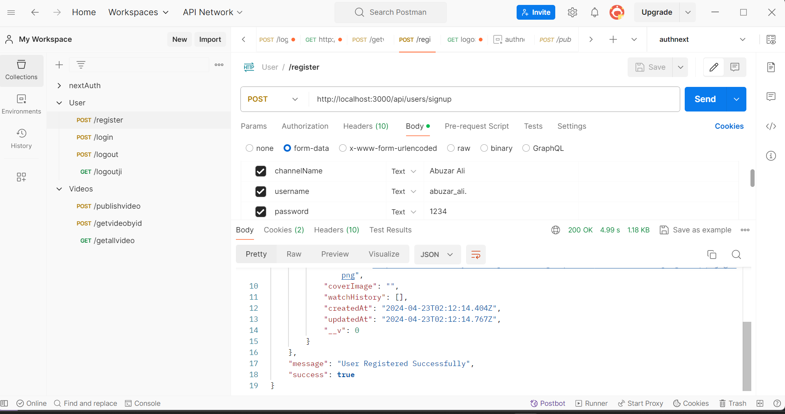
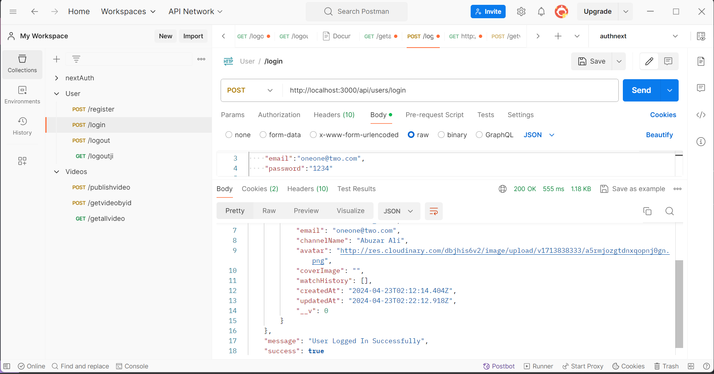
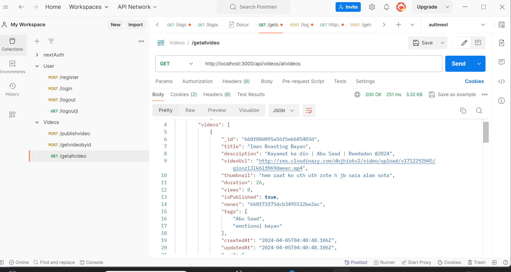

# Backend Learning Journey

model link
https://app.eraser.io/workspace/YtPqZ1VogxGy1jzIDkzj

This repository contains the backend implementation for YouTube, a platform where users can create channels and upload videos. The uploaded videos are securely saved on Cloudinary for efficient storage and retrieval.

# Features:
- User authentication and authorization system.
- Channel creation functionality for users.
- Video upload capability with integration with Cloudinary for cloud-based storage.
- Robust API endpoints for managing users, channels, and videos.
- Secure handling of user data and video content.

# Technologies used:
- Node.js for server-side scripting.
- Express.js for building RESTful APIs.
- MongoDB for database storage.
- Cloudinary for storing and managing uploaded videos.
- JWT (JSON Web Tokens) for secure user authentication

# Setup Instructions
To get started with this repository, follow these steps: 
-->If you want only the backend:
```bash
1. Clone the repository to your local machine
- git clone <repository_url>
2. Navigate to the project directory
- cd <project_name>
3. Install the required dependencies using npm:
- npm install
4. Create a .env file based on the provided .env.sample file and fill in the necessary environment variables as required by the project.
5. you can start the development server by running:
- npm run dev
This command will start the server and enable you to begin development or testing tasks.
```

# Backend testing ScreenShots
- signup

- login 

- get allvideos
